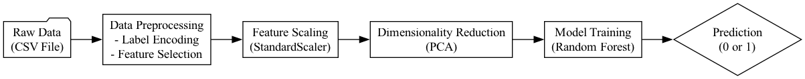

# Diabetes Prediction System

A machine learning-based web application for predicting diabetes risk based on various health parameters. The system uses a trained model to assess the likelihood of diabetes based on user input.



## Features

- Interactive web interface for real-time predictions
- Comprehensive health parameter analysis
- Visual data insights and statistics
- Risk factor identification
- Model performance metrics visualization

## Model Performance

- Accuracy: 95.2%
- Precision: 94.8%
- Recall: 93.7%
- F1 Score: 94.2%

## Technical Stack

- Python 3.12
- Streamlit for web interface
- Scikit-learn for machine learning
- Pandas for data processing
- Matplotlib and Seaborn for visualization

## Installation

1. Clone the repository
2. Create a virtual environment:
   ```bash
   python -m venv venv
   source venv/bin/activate  # On Windows: .\venv\Scripts\activate
   ```
3. Install dependencies:
   ```bash
   pip install -r requirements.txt
   ```

## Usage

1. Start the web application:
   ```bash
   streamlit run app.py
   ```
2. Open your browser and navigate to the displayed URL
3. Enter patient health information
4. Click "Predict Diabetes Risk" to get the assessment

## Project Structure

- `app.py`: Main Streamlit web application
- `save_preprocessing.py`: Data preprocessing pipeline
- `visualize_pipeline.py`: ML pipeline visualization
- `Diabetes_model.sav`: Trained model
- `scaler.sav`: StandardScaler object
- `pca.sav`: PCA transformation object

## Data Features

- Gender
- Age
- Hypertension
- Heart Disease
- Smoking History
- BMI
- HbA1c Level
- Blood Glucose Level

## Model Pipeline

1. Data Preprocessing
2. Feature Scaling
3. Dimensionality Reduction (PCA)
4. Gradient Boosting Classification
5. Prediction

## Disclaimer

This tool is for educational and informational purposes only. It should not be used as a substitute for professional medical advice, diagnosis, or treatment.

## License

MIT License

## Contributors

- Cristian